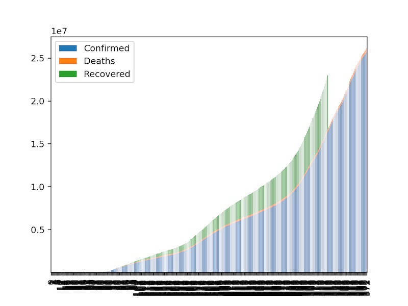
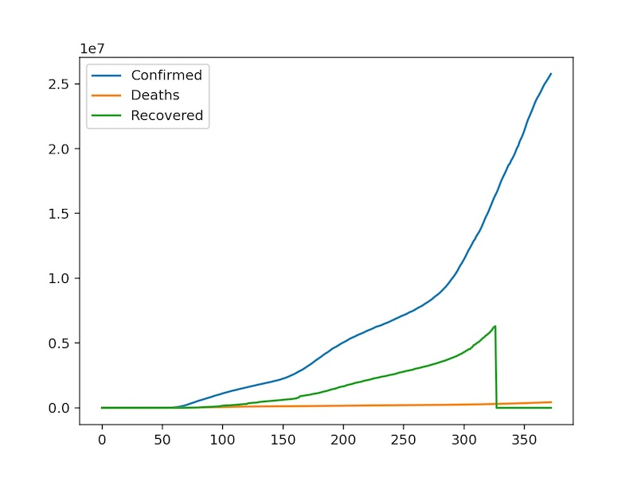

# Accessing Data From S3

This example shows how to configure a JupyterLab docker image to access data from AWS S3.

## Build a Docker Image with AWS Related JARs

First, we need to build a docker image that includes the missing jars files needed for accessing S3. You can also add the jars using a volume mount, and then include code in your notebook to update the `PYSPARK_SUBMIT_ARGS` to include the jars from their location within the docker image. I felt like baking the jars into the docker image was a little easier that having to run a code cell to update the `PYSPARK_SUBMIT_ARGS`.

This example is using Spark 3.0.1 with Hadoop 3.2, and the files that we're adding are:

* aws-java-sdk-bundle-1.11.950.jar
* hadoop-aws-3.2.0.jar
* jets3t-0.9.4.jar

Here is an example Dockerfile to use:

```
FROM jupyter/pyspark-notebook:8ea7abc5b7bc

USER root

ENV PYSPARK_SUBMIT_ARGS '--packages com.amazonaws:aws-java-sdk:1.11.950,org.apache.hadoop:hadoop-aws:3.2.0,net.java.dev.jets3t:jets3t:0.9.4 pyspark-shell'


# Download missing jars

# Get AWS SDK JAR
RUN (cd /usr/local/spark/jars && curl -O https://repo1.maven.org/maven2/com/amazonaws/aws-java-sdk-bundle/1.11.950/aws-java-sdk-bundle-1.11.950.jar)

# Get Hadoop-AWS Jar
RUN (cd /usr/local/spark/jars && curl -O https://repo1.maven.org/maven2/org/apache/hadoop/hadoop-aws/3.2.0/hadoop-aws-3.2.0.jar)

# Get jets3t JAR
RUN (cd /usr/local/spark/jars && curl -O https://repo1.maven.org/maven2/net/java/dev/jets3t/jets3t/0.9.4/jets3t-0.9.4.jar)

USER $NB_UID
```


## Run the Docker Container and Pass in AWS Credentials

This example is assuming that you have appropriate credentials saved in $HOME/.aws/credentials, and have jq installed.

Fetch temporary credentials from AWS and run the docker container with the credentials and session token passed in as environment variables:

```bash
creds_json=$(aws --profile default --region us-west-2 sts get-session-token)

docker run -d --name jupyter --rm -p 8888:8888 \
  -e AWS_ACCESS_KEY_ID=$(echo "$creds_json" | jq -r .Credentials.AccessKeyId) \
  -e AWS_SECRET_ACCESS_KEY=$(echo "$creds_json" | jq -r .Credentials.SecretAccessKey) \
  -e AWS_SESSION_TOKEN=$(echo "$creds_json" | jq -r .Credentials.SessionToken) \
  jupyter-docker:yourtag jupyter lab --LabApp.token ''
```


## Configure Spark


```python
from pyspark.sql import SparkSession
```


```python
import logging
logging.getLogger().setLevel(logging.DEBUG)
```

### Set the SparkSession Thread Count and Memory

If you have JupyterLab running in the cloud, and you can afford to run enough instances where you're not overly concerned with cost, then don't worry about this section. If you are running JupyterLab on a single machine (for example, a laptop with limited resources), and the amount of data you want to process is more than you have available on the machine, then you might want to be thoughtful about how you initialize the SparkSession. If the single machine (perhaps your home laptop) use case sounds like you, then this is what I considered when configuring the SparkSession.

I have 8 cores and 16GB of memory available on my laptop, and I configured Docker to use 4 cores and up to 3GB of memory. 


Things to consider if the Spark cluster is on a constrained system:

* How much memory do you have available for your Spark job?
    > If you don't have much memory available, then consider reading the [Spark Memory Tuning Guide](https://spark.apache.org/docs/latest/tuning.html#memory-tuning). There are great suggestions for everything from changing the default serializer to being aware of the impacts of using broadcast variables.
* How much data do you plan to process? 
    > You also might want to be aware of the format that your source data is in. [Here is a nice article comparing CSV, JSON, and Parquet](https://www.linkedin.com/pulse/spark-file-format-showdown-csv-vs-json-parquet-garren-staubli/). If your data is in JSON, but you want to process the data as Parquet, then consider creating a job to convert the data to Parquet before using the data in your processing jobs.


```python
MAX_MEMORY = "2g"

spark = SparkSession.builder \
    .master("local[4]") \
    .appName("Covid19TimeSeries") \
    .config("spark.executor.memory", MAX_MEMORY) \
    .config("spark.driver.memory", MAX_MEMORY) \
    .config("fs.s3a.path.style.access", True) \
    .config("fs.s3a.aws.credentials.provider", "org.apache.hadoop.fs.s3a.TemporaryAWSCredentialsProvider") \
    .config("fs.s3a.endpoint", "s3.us-west-2.amazonaws.com") \
    .config("fs.s3a.impl", "org.apache.hadoop.fs.s3a.S3AFileSystem") \
    .config("com.amazonaws.services.s3.enableV4", True) \
    .config("spark.driver.extraJavaOptions", "-Dcom.amazonaws.services.s3.enableV4=true") \
    .getOrCreate()
```

## Read Data From S3

At this point you should be able to read data in from S3.


```python
s3path = "s3a://dev-leewallen-spark/covid-19-time-series/parquet/covid-19.parquet"
```


```python
parquetDF = spark.read.parquet(s3path)
```


```python
from pyspark.sql.functions import col 
```


```python
parquetDF.show(5)
```

    +---------+--------------+----------+------+--------------+---------+
    |Confirmed|Country/Region|      Date|Deaths|Province/State|Recovered|
    +---------+--------------+----------+------+--------------+---------+
    |        0|   Afghanistan|2020-01-22|     0|          null|        0|
    |        0|   Afghanistan|2020-01-23|     0|          null|        0|
    |        0|   Afghanistan|2020-01-24|     0|          null|        0|
    |        0|   Afghanistan|2020-01-25|     0|          null|        0|
    |        0|   Afghanistan|2020-01-26|     0|          null|        0|
    +---------+--------------+----------+------+--------------+---------+
    only showing top 5 rows
    


```python
usConfirmed = parquetDF.filter((col('`Country/Region`') == "US"))
```


```python
# import chart_studio.plotly as py
# import plotly.graph_objects as go
# from  plotly.offline import plot
import pandas as pd
import matplotlib.pyplot as plt
import requests
requests.packages.urllib3.disable_warnings()
```


```python
usConfirmed.show(5)
```

    +---------+--------------+----------+------+--------------+---------+
    |Confirmed|Country/Region|      Date|Deaths|Province/State|Recovered|
    +---------+--------------+----------+------+--------------+---------+
    |        1|            US|2020-01-22|     0|          null|        0|
    |        1|            US|2020-01-23|     0|          null|        0|
    |        2|            US|2020-01-24|     0|          null|        0|
    |        2|            US|2020-01-25|     0|          null|        0|
    |        5|            US|2020-01-26|     0|          null|        0|
    +---------+--------------+----------+------+--------------+---------+
    only showing top 5 rows
    


```python
usConfirmed.printSchema()
```

    root
     |-- Confirmed: long (nullable = true)
     |-- Country/Region: string (nullable = true)
     |-- Date: string (nullable = true)
     |-- Deaths: long (nullable = true)
     |-- Province/State: string (nullable = true)
     |-- Recovered: long (nullable = true)
    


```python
from pyspark.sql.types import DateType

usConfirmed = usConfirmed.withColumn("DateTS",usConfirmed["Date"].cast(DateType()))
```


```python
usConfirmed.show()
usConfirmed.printSchema()
```

    +---------+--------------+----------+------+--------------+---------+----------+
    |Confirmed|Country/Region|      Date|Deaths|Province/State|Recovered|    DateTS|
    +---------+--------------+----------+------+--------------+---------+----------+
    |        1|            US|2020-01-22|     0|          null|        0|2020-01-22|
    |        1|            US|2020-01-23|     0|          null|        0|2020-01-23|
    |        2|            US|2020-01-24|     0|          null|        0|2020-01-24|
    |        2|            US|2020-01-25|     0|          null|        0|2020-01-25|
    |        5|            US|2020-01-26|     0|          null|        0|2020-01-26|
    |        5|            US|2020-01-27|     0|          null|        0|2020-01-27|
    |        5|            US|2020-01-28|     0|          null|        0|2020-01-28|
    |        6|            US|2020-01-29|     0|          null|        0|2020-01-29|
    |        6|            US|2020-01-30|     0|          null|        0|2020-01-30|
    |        8|            US|2020-01-31|     0|          null|        0|2020-01-31|
    |        8|            US|2020-02-01|     0|          null|        0|2020-02-01|
    |        8|            US|2020-02-02|     0|          null|        0|2020-02-02|
    |       11|            US|2020-02-03|     0|          null|        0|2020-02-03|
    |       11|            US|2020-02-04|     0|          null|        0|2020-02-04|
    |       11|            US|2020-02-05|     0|          null|        0|2020-02-05|
    |       12|            US|2020-02-06|     0|          null|        0|2020-02-06|
    |       12|            US|2020-02-07|     0|          null|        0|2020-02-07|
    |       12|            US|2020-02-08|     0|          null|        0|2020-02-08|
    |       12|            US|2020-02-09|     0|          null|        3|2020-02-09|
    |       12|            US|2020-02-10|     0|          null|        3|2020-02-10|
    +---------+--------------+----------+------+--------------+---------+----------+
    only showing top 20 rows
    
    root
     |-- Confirmed: long (nullable = true)
     |-- Country/Region: string (nullable = true)
     |-- Date: string (nullable = true)
     |-- Deaths: long (nullable = true)
     |-- Province/State: string (nullable = true)
     |-- Recovered: long (nullable = true)
     |-- DateTS: date (nullable = true)
    


```python
usPandas = usConfirmed.toPandas()
```


```python
usPandas
```


<div>
<style scoped>
    .dataframe tbody tr th:only-of-type {
        vertical-align: middle;
    }

    .dataframe tbody tr th {
        vertical-align: top;
    }

    .dataframe thead th {
        text-align: right;
    }
</style>
<table border="1" class="dataframe">
  <thead>
    <tr style="text-align: right;">
      <th></th>
      <th>Confirmed</th>
      <th>Country/Region</th>
      <th>Date</th>
      <th>Deaths</th>
      <th>Province/State</th>
      <th>Recovered</th>
      <th>DateTS</th>
    </tr>
  </thead>
  <tbody>
    <tr>
      <th>0</th>
      <td>1</td>
      <td>US</td>
      <td>2020-01-22</td>
      <td>0</td>
      <td>None</td>
      <td>0</td>
      <td>2020-01-22</td>
    </tr>
    <tr>
      <th>1</th>
      <td>1</td>
      <td>US</td>
      <td>2020-01-23</td>
      <td>0</td>
      <td>None</td>
      <td>0</td>
      <td>2020-01-23</td>
    </tr>
    <tr>
      <th>2</th>
      <td>2</td>
      <td>US</td>
      <td>2020-01-24</td>
      <td>0</td>
      <td>None</td>
      <td>0</td>
      <td>2020-01-24</td>
    </tr>
    <tr>
      <th>3</th>
      <td>2</td>
      <td>US</td>
      <td>2020-01-25</td>
      <td>0</td>
      <td>None</td>
      <td>0</td>
      <td>2020-01-25</td>
    </tr>
    <tr>
      <th>4</th>
      <td>5</td>
      <td>US</td>
      <td>2020-01-26</td>
      <td>0</td>
      <td>None</td>
      <td>0</td>
      <td>2020-01-26</td>
    </tr>
    <tr>
      <th>...</th>
      <td>...</td>
      <td>...</td>
      <td>...</td>
      <td>...</td>
      <td>...</td>
      <td>...</td>
      <td>...</td>
    </tr>
    <tr>
      <th>368</th>
      <td>25147891</td>
      <td>US</td>
      <td>2021-01-24</td>
      <td>419251</td>
      <td>None</td>
      <td>0</td>
      <td>2021-01-24</td>
    </tr>
    <tr>
      <th>369</th>
      <td>25298986</td>
      <td>US</td>
      <td>2021-01-25</td>
      <td>421168</td>
      <td>None</td>
      <td>0</td>
      <td>2021-01-25</td>
    </tr>
    <tr>
      <th>370</th>
      <td>25445583</td>
      <td>US</td>
      <td>2021-01-26</td>
      <td>425252</td>
      <td>None</td>
      <td>0</td>
      <td>2021-01-26</td>
    </tr>
    <tr>
      <th>371</th>
      <td>25598061</td>
      <td>US</td>
      <td>2021-01-27</td>
      <td>429195</td>
      <td>None</td>
      <td>0</td>
      <td>2021-01-27</td>
    </tr>
    <tr>
      <th>372</th>
      <td>25762726</td>
      <td>US</td>
      <td>2021-01-28</td>
      <td>433067</td>
      <td>None</td>
      <td>0</td>
      <td>2021-01-28</td>
    </tr>
  </tbody>
</table>
<p>373 rows × 7 columns</p>
</div>


### Pandas Plot Related Settings


```python
pd.options.plotting.matplotlib.register_converters = True
plt.close("all")
```

### Make the Plot Interactive

Make the plot resizeable, and provide an interface so you can save your plot.


```python
%matplotlib widget
```


```python
usPandas.plot.bar(stacked=True)
```





```python
usPandas.plot()
```





